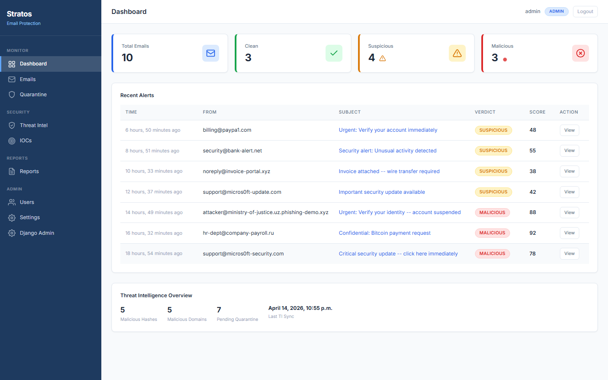
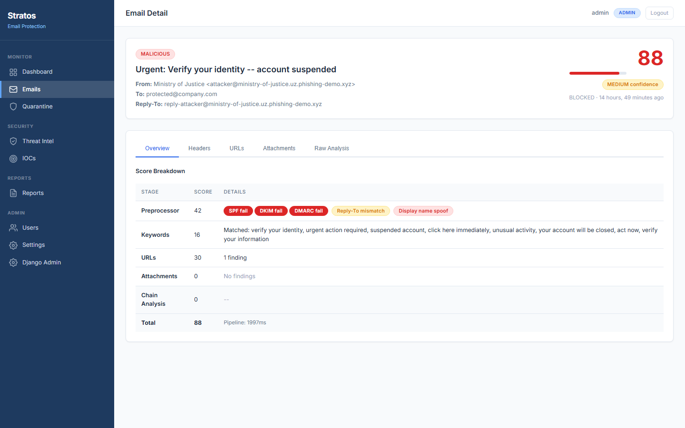
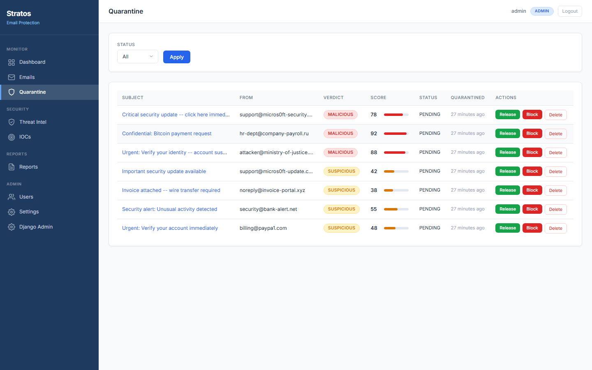
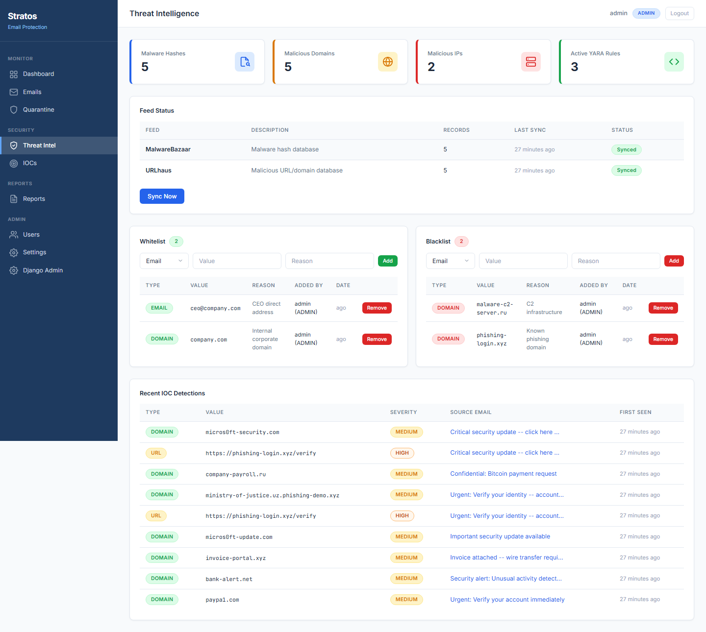
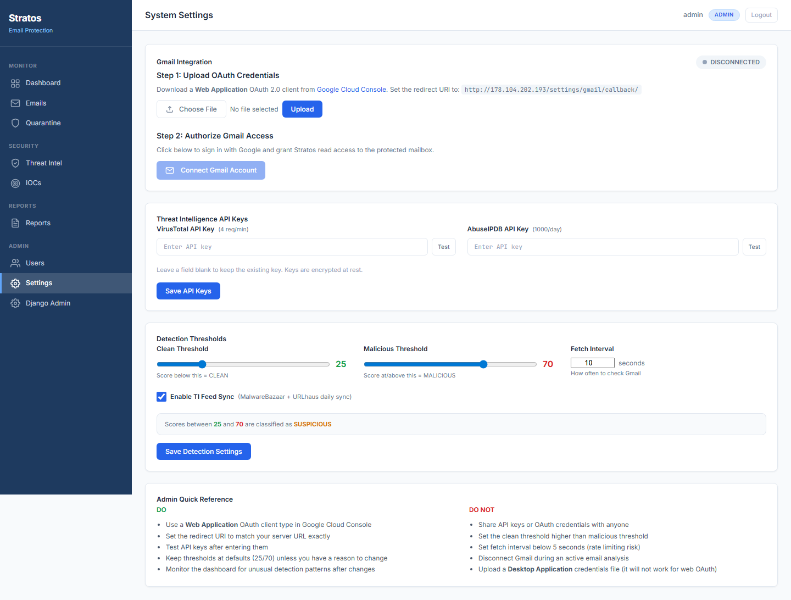

# Stratos -- Business Email Protection System

> **"Threats burn up before they land"**

Stratos is a multi-layered Business Email Protection (BEP) platform that analyses every incoming email through a three-stage detection pipeline and assigns a verdict of **Clean**, **Suspicious**, or **Malicious**. Built as a BSc BIS final-year project at Westminster International University in Tashkent (WIUT), Stratos is inspired by Group-IB's production BEP architecture and adapted to student scale.

---

## Features

| Feature | Detail |
|---|---|
| **Email ingestion** | Gmail API connector with browser-based OAuth setup |
| **Preprocessing** | SPF / DKIM / DMARC scoring, whitelist/blacklist |
| **Keyword detection** | 24 phishing keywords, +2 points each, max +20 |
| **URL analysis** | URLhaus + VirusTotal lookup, IP-based URL detection, shortener detection |
| **Attachment scanning** | SHA-256 vs MalwareBazaar, 13 dangerous extensions, double-extension, MIME mismatch |
| **YARA scanning** | 6 custom rules: VBA macro, PE executable, JS obfuscation, double extension, OLE, ransomware |
| **Received chain** | Hop count anomaly, private IP in public chain, timestamp disorder |
| **Threat intelligence** | MalwareBazaar + URLhaus daily sync via Celery Beat |
| **Verdict engine** | Score 0-100, configurable thresholds (default: CLEAN <25, SUSPICIOUS 25-69, MALICIOUS >=70) |
| **Dashboard** | 10 pages, light theme, role-based access (Admin / Analyst / Viewer) |
| **System Settings** | ADMIN-only UI for Gmail OAuth, API keys (encrypted), detection thresholds |
| **REST API** | 5 endpoints, DRF, Session + Token authentication |
| **Export** | CSV email summary, IOC export, JSON TI stats |
| **Testing** | 473 tests, 95%+ coverage on core pipeline |
| **Production ready** | Docker Compose + Caddy reverse proxy + gunicorn |

---

## Architecture

```
Email --> PARSE --> PREPROCESS --> CHECK --> DECIDE --> ACT
                                                       |
         Target: <30 seconds              CLEAN / SUSPICIOUS / MALICIOUS
```

### Three-Stage Pipeline

| Stage | Component | Max Score | Key Checks |
|-------|-----------|-----------|------------|
| 1 | **Preprocessor** | ~65 | SPF/DKIM/DMARC auth, blacklist (+40/+30), Reply-To mismatch (+10), display spoof (+10) |
| 2 | **Checker** | +125 | Keywords (max +20), URLs (max +40), Attachments (max +50), Chain (max +15) |
| 3 | **Decider** | - | Aggregates scores, applies thresholds, known malware override |

### Verdict Thresholds (configurable via Settings UI)

| Score | Verdict | Action |
|-------|---------|--------|
| 0-24 | CLEAN | Delivered to inbox |
| 25-69 | SUSPICIOUS | Quarantined for analyst review |
| 70-100 | MALICIOUS | Blocked automatically |

---

## Tech Stack

| Layer | Technology |
|-------|-----------|
| Backend | Python 3.10+, Django 4.2, Django REST Framework |
| Database | PostgreSQL 15 |
| Task Queue | Redis 7 + Celery 5.3 |
| Email Source | Gmail API (OAuth2 web flow) |
| TI Feeds | MalwareBazaar, URLhaus, VirusTotal, AbuseIPDB |
| Detection | yara-python, python-magic |
| Frontend | Django templates, vanilla JS, Inter font |
| Deployment | Docker Compose (6 containers: django, postgres, redis, celery, celery-beat, caddy) |
| Security | Fernet-encrypted API keys, RBAC, whitenoise, gunicorn |

---

## Quick Start

### Option A: Docker (recommended)

```bash
git clone https://github.com/Diyara03/stratos-bep.git
cd stratos-bep

cp .env.example .env
# Edit .env: set SECRET_KEY, POSTGRES_PASSWORD, ALLOWED_HOSTS

# Development
docker compose up -d

# Production (with Caddy reverse proxy + gunicorn)
docker compose -f docker-compose.prod.yml up -d
```

### Option B: Local Development

```bash
python -m venv venv
source venv/bin/activate  # or venv\Scripts\activate on Windows
pip install -r requirements.txt
python manage.py migrate
python manage.py demo_setup
python manage.py runserver
```

### Demo Credentials

| Username | Password | Role |
|----------|----------|------|
| admin | admin123 | Admin (full access) |
| analyst | analyst123 | Analyst (review + export) |
| viewer | viewer123 | Viewer (read only) |

Run `python manage.py demo_setup` to create these users and 10 sample emails.

---

## Deployment (Hetzner Cloud)

Full step-by-step guide: [docs/DEPLOYMENT.md](docs/DEPLOYMENT.md)

```bash
# On the server (Ubuntu 22.04)
apt update && apt upgrade -y
curl -fsSL https://get.docker.com | sh
apt install -y docker-compose-plugin

cd /opt
git clone https://github.com/Diyara03/stratos-bep.git stratos
cd stratos

cp .env.example .env
nano .env  # Set SECRET_KEY, POSTGRES_PASSWORD, ALLOWED_HOSTS

docker compose -f docker-compose.prod.yml up -d
docker compose -f docker-compose.prod.yml exec django python manage.py createsuperuser
```

Access at `http://YOUR_SERVER_IP`. Configure Gmail and API keys via **Settings** (Admin > Settings).

---

## System Settings (ADMIN only)

After deployment, configure integrations through the browser — no SSH needed:

| Setting | How |
|---------|-----|
| **Gmail** | Upload OAuth credentials JSON, click "Connect Gmail Account", authorize via Google |
| **VirusTotal** | Paste API key, click Test, Save |
| **AbuseIPDB** | Paste API key, click Test, Save |
| **Thresholds** | Adjust Clean/Malicious sliders, Save |
| **Fetch interval** | Set polling frequency (default: 10s) |
| **TI sync** | Toggle daily MalwareBazaar + URLhaus import |

API keys are encrypted at rest (Fernet AES-128-CBC). Full guide: [docs/ADMIN_GUIDE.md](docs/ADMIN_GUIDE.md)

---

## Project Structure

```
stratos-bep/
  accounts/          # User model with RBAC (Admin/Analyst/Viewer)
  emails/            # Core app: models, services, views, settings
    services/
      preprocessor.py  # SPF/DKIM/DMARC + whitelist/blacklist
      checker.py       # Keywords, URLs, attachments, chain
      decider.py       # Score aggregation + verdict
      analyzer.py      # Pipeline orchestrator
      parser.py        # Gmail message parser
      gmail_connector.py
    settings_views.py  # System configuration UI
    management/commands/
      demo_setup.py    # Create demo scenario
      demo_teardown.py # Clean demo data
  threat_intel/      # TI models + sync tasks
  reports/           # Export + report models
  stratos_server/    # Django project settings
  templates/         # 11 HTML templates (light theme)
  static/            # CSS + JS + favicon
  tests/             # 473 tests across 19 files
  docs/              # Architecture, deployment, admin guide, playbook
  docker-compose.yml
  docker-compose.prod.yml
  Caddyfile
```

---

## Key Numbers

| Metric | Value |
|--------|-------|
| Django models | 16 across 4 apps |
| Tests | 473 (all passing) |
| Coverage (core) | 95%+ |
| UI pages | 10 |
| API endpoints | 5 |
| Settings endpoints | 10 |
| Phishing keywords | 24 |
| YARA rules | 6 |
| Dangerous extensions | 13 |
| Docker services | 6 (prod) |

---

## Screenshots

| Page | Screenshot |
|------|-----------|
| Dashboard |  |
| Email Detail |  |
| Quarantine |  |
| Threat Intel |  |
| Settings |  |

---

## Management Commands

```bash
python manage.py demo_setup          # Full demo scenario (10 emails, TI data, users)
python manage.py demo_setup --flush  # Clear and recreate
python manage.py demo_teardown       # Remove demo data, keep users
python manage.py sync_ti_feeds       # Manual TI feed sync
python manage.py fetch_emails        # Manual Gmail fetch
```

---

## API Endpoints

| Method | Endpoint | Description |
|--------|----------|-------------|
| GET | `/api/emails/` | Paginated email list (filterable) |
| GET | `/api/emails/<pk>/` | Email detail with full analysis |
| GET | `/api/quarantine/` | Quarantine entries |
| POST | `/api/quarantine/<pk>/action/` | Release / block / delete |
| GET | `/api/dashboard/stats/` | Dashboard statistics JSON |

All endpoints require authentication (Session or Token).

---

## Documentation

| Document | Description |
|----------|-------------|
| [DEPLOYMENT.md](docs/DEPLOYMENT.md) | Step-by-step Hetzner deployment guide |
| [ADMIN_GUIDE.md](docs/ADMIN_GUIDE.md) | Admin usage instructions |
| [ARCHITECTURE.md](docs/ARCHITECTURE.md) | System architecture reference |
| [HOW.md](docs/HOW.md) | Technical implementation details |
| [WHY.md](docs/WHY.md) | Business justification per component |
| PLAYBOOK.docx | UI playbook with screenshots for all 3 roles |

---

## Academic Context

- **University:** Westminster International University in Tashkent (WIUT)
- **Degree:** BSc (Hons) Business Information Systems
- **Module:** 6BUIS007C-n (Business Information Systems Project)
- **Inspired by:** Group-IB Business Email Protection

---

## License

This project was developed as an academic submission. Copyright belongs to the University of Westminster per BISP handbook Section 4, Appendix 3.
